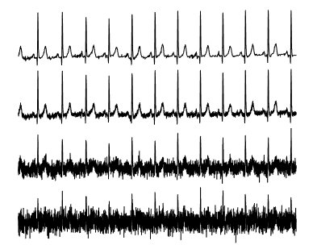
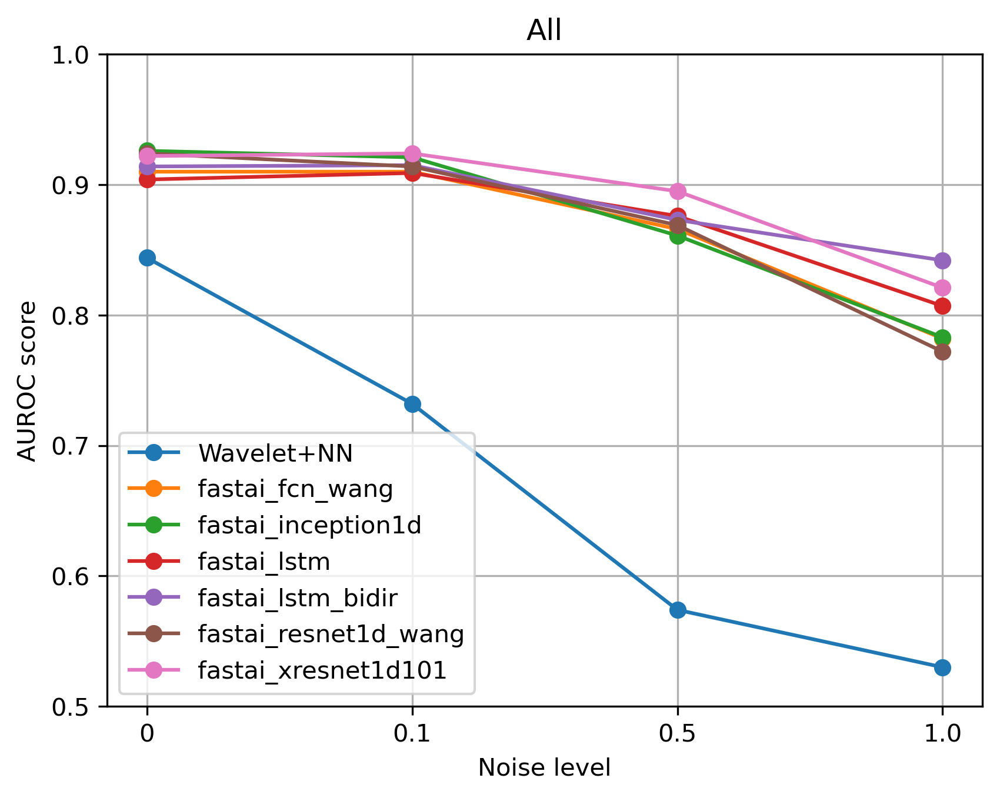
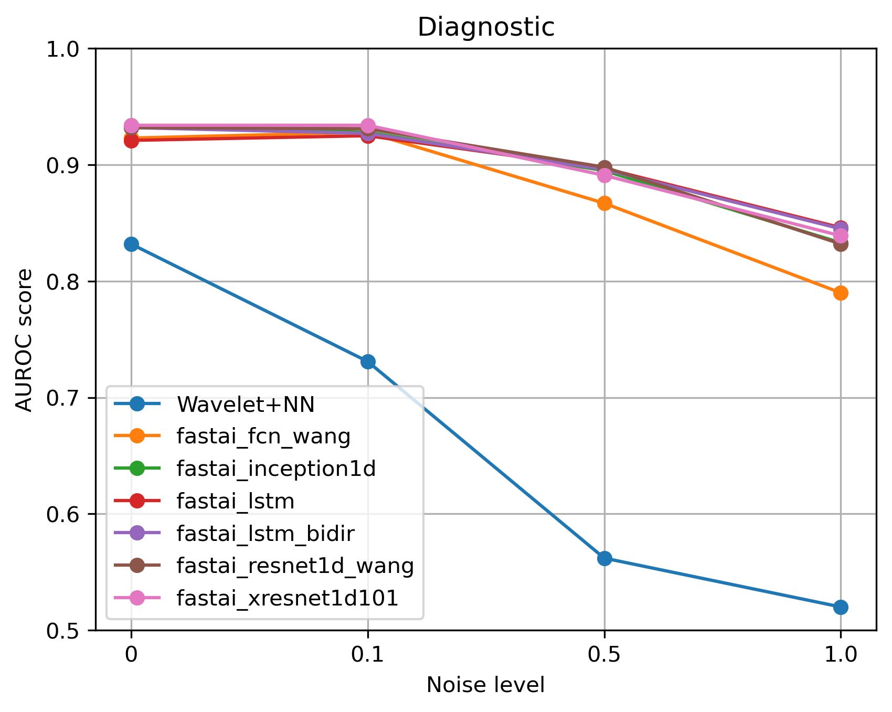
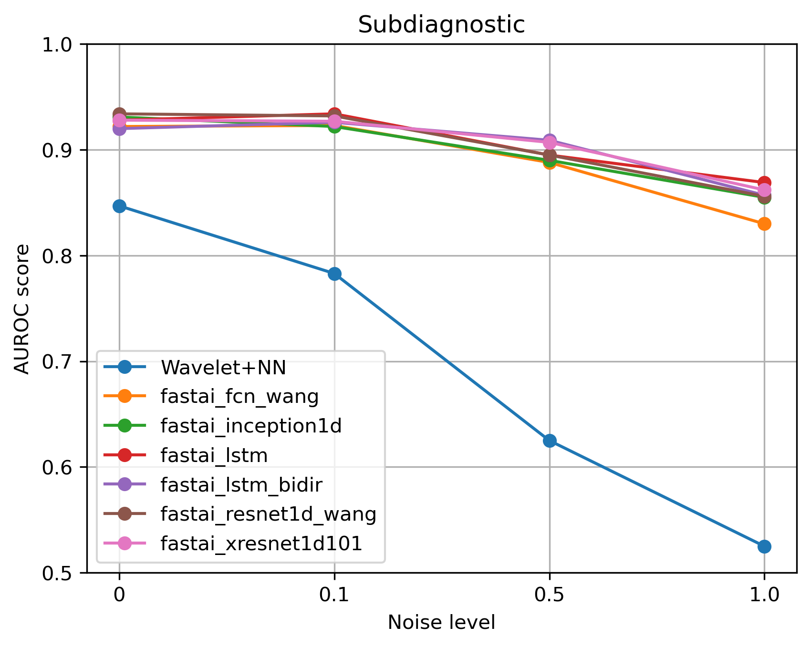
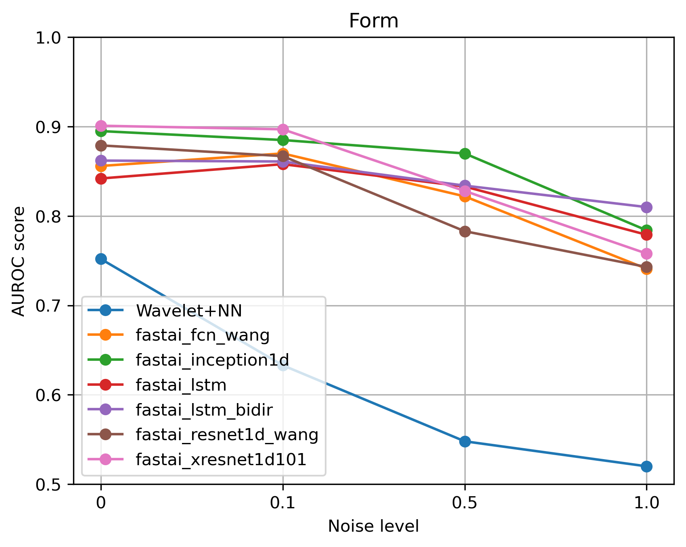
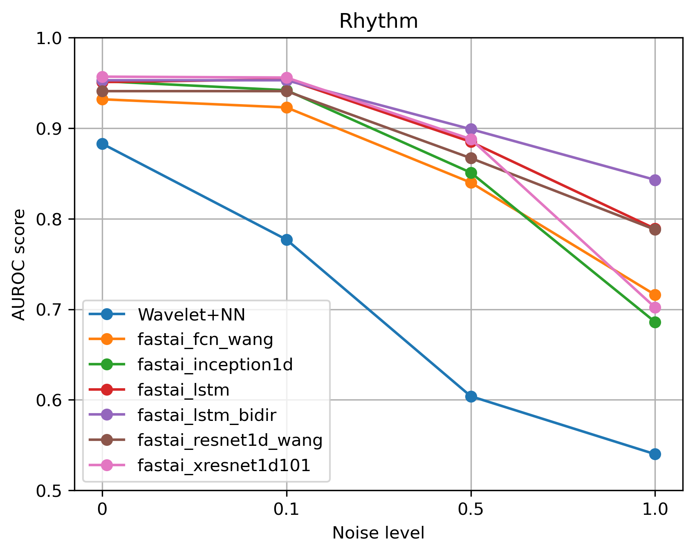

# [Re] Deep Learning for ECG Analysis: Benchmarks and Insights from PTB-XL
## A replication of Deep Learning for ECG Analysis: Benchmarks and Insights from PTB-XL by Strodthoff et al. 2021

This github repository comprises our code replicating the experiments reported in [*Deep Learning for ECG Analysis: Benchmarks and Insights from PTB-XL*](https://ieeexplore.ieee.org/document/9190034)

Full reference to the original paper :
> N. Strodthoff, P. Wagner, T. Schaeffter, and W. Samek, ‘Deep Learning for ECG Analysis: Benchmarks and Insights from PTB-XL’, IEEE Journal of Biomedical and Health Informatics, vol. 25, no. 5, pp. 1519–1528, May 2021, doi: 10.1109/JBHI.2020.3022989.

Original github repository: https://github.com/helme/ecg_ptbxl_benchmarking

The main goal of this project was to reproduce the results from Strodthoff et al (2021). In addition, we tested the robustness of the proposed models by adding random noise to the ECGs in the test set. Finally, we  used the provided template to implement a new model and evaluated it on the six benchmark tasks described in Strodthoff et al.

## Setup and requirements

To re-run our replication experiments, simply upload the notebook `PTB_XL_experiments.ipynb` to [Google colab](https://colab.research.google.com/) and run the code cells. In the second code cell you will be asked to mount your Google Drive to the Google colab notebook. This is not mandatory, but it is recommended if you want to store the results the experiments.

### Data
The dataset (PTB-XL) will be downloaded from the [original data repository](https://physionet.org/content/ptb-xl/1.0.3/)  in the 5th code cell of the `PTB_XL_experiments.ipynb` notebook.

### Dependencies
A [custom version of Fast AI](https://github.com/Bsingstad/fastai) was created to make the original repository compatible with Google Colab notebooks. This is taken care of in code cell 11 in `PTB_XL_experiments.ipynb`.

### Hyperparameter search
To perform hyperparameter search for our Inception Time model we first made a file describing all parameter combinations using `make_gridsearch_file.ipynb`, resulting in `gridsearch_params.csv`. Furthermore, we use this .csv file in `Gridsearch.ipynb`.

## Results
### Replicating results from Strodthoff et al.
The table presented below show the replicated results of Strodthoff et al. The results are obtained taking the mean of repeated (3 times) bootstrapping on the test set.

| Method | All | Diagnostic | Subdiagnostic | Superdiagnostic | Form | Rhythm |
|----------------------------------------|--------------------------------------|---------------------------------------------|------------------------------------------------|--------------------------------------------------|---------------------------------------|-----------------------------------------|
| fastai_inception1d                    |  0.926           |  0.930                  |  0.930                     |  0.918                       |  0.891            |  0.953              |
| fastai_xresnet1d101                   |  0.925           |  0.934                  |  0.926                     |  0.929                       |  0.898            |  0.959              |
| fastai_resnet1d\_wang                 | 0.919           | 0.932                  | 0.932                     | 0.929                       | 0.873            | 0.943              |
| fastai_fcn_wang                      | 0.913           | 0.927                  | 0.922                     | 0.926                       | 0.868            | 0.928              |
| fastai_lstm                           | 0.906           | 0.926                  | 0.928                     | 0.927                       | 0.849            | 0.950              |
| fastai_lstm_bidir                    | 0.915           | 0.929                  | 0.924                     | 0.924                       | 0.856              |  0.949              |
| Wavelet+NN                             | 0.837           | 0.834                    | 0.847                     | 0.871                       | 0.765            | 0.879              |
| ensemble                               | 0.927           | 0.937                  | 0.935                     | 0.934                       | 0.901            | 0.966              |

### Noise
To be able to add noise to the test data we modified  the `prepare()` method in the `SCP_Experiment` class, defined in `./code/experiments/scp_experiment.py`. `prepare()` takes the arguments `add_noise=Boolean`, `noise_mean=Float`, `noise_std_dev=Float`.

The image below show an example of a ECG with `noise_mean` = 0and `noise_std_dev`= 0, 0.1, 0.5 and 1

The figures bellow show how the performance (in AUROC) decrease when more noise are added to the test ECGs.

|                               |                                 |
:------------------------------:|:--------------------------------:
            | 
  | 
           | 

### Implementing a new model
The following tables presents the results obtained in the original paper as well as the results obtained by the Inception Time model (**bold**) in this work.

The model code for this model can be found in `./code/models/your_model.py` and the configurations for the different benchmark tasks are located here: `./code/configs/your_configs.py`. Finally, it also has to be specified in `./code/reproduce_results.py` which models that should be used and which benchmark tasks.

 #### 1. PTB-XL: all statements

| Model | AUC &darr; | paper/source | code |
|---:|:---|:---|:---|
| **Inception Time** | **0.926(08)** | **our work** | **this repo** |
| inception1d | 0.925(08) | [original work](https://doi.org/10.1109/jbhi.2020.3022989) | [code](https://github.com/helme/ecg_ptbxl_benchmarking/)|
| xresnet1d101 | 0.925(07) | [original work](https://doi.org/10.1109/jbhi.2020.3022989) | [code](https://github.com/helme/ecg_ptbxl_benchmarking/)|
| resnet1d_wang | 0.919(08) | [original work](https://doi.org/10.1109/jbhi.2020.3022989) | [code](https://github.com/helme/ecg_ptbxl_benchmarking/)|
| fcn_wang | 0.918(08) | [original work](https://doi.org/10.1109/jbhi.2020.3022989) | [code](https://github.com/helme/ecg_ptbxl_benchmarking/)|
| lstm_bidir | 0.914(08) | [original work](https://doi.org/10.1109/jbhi.2020.3022989) | [code](https://github.com/helme/ecg_ptbxl_benchmarking/)|
| lstm | 0.907(08) | [original work](https://doi.org/10.1109/jbhi.2020.3022989) | [code](https://github.com/helme/ecg_ptbxl_benchmarking/)|
| Wavelet+NN | 0.849(13) | [original work](https://doi.org/10.1109/jbhi.2020.3022989) | [code](https://github.com/helme/ecg_ptbxl_benchmarking/)|

 #### 2. PTB-XL: diagnostic statements

| Model | AUC &darr; | paper/source | code |
|---:|:---|:---|:---|
| xresnet1d101 | 0.937(08) | [original work](https://doi.org/10.1109/jbhi.2020.3022989) | [code](https://github.com/helme/ecg_ptbxl_benchmarking/)|
| resnet1d_wang | 0.936(08) | [original work](https://doi.org/10.1109/jbhi.2020.3022989) | [code](https://github.com/helme/ecg_ptbxl_benchmarking/)|
| lstm_bidir | 0.932(07) | [original work](https://doi.org/10.1109/jbhi.2020.3022989) | [code](https://github.com/helme/ecg_ptbxl_benchmarking/)|
| inception1d | 0.931(09) | [original work](https://doi.org/10.1109/jbhi.2020.3022989) | [code](https://github.com/helme/ecg_ptbxl_benchmarking/)|
| **Inception Time** | **0.929(09)** | **our work** | **this repo** |
| lstm | 0.927(08) | [original work](https://doi.org/10.1109/jbhi.2020.3022989) | [code](https://github.com/helme/ecg_ptbxl_benchmarking/)|
| fcn_wang | 0.926(10) | [original work](https://doi.org/10.1109/jbhi.2020.3022989) | [code](https://github.com/helme/ecg_ptbxl_benchmarking/)|
| Wavelet+NN | 0.855(15) | [original work](https://doi.org/10.1109/jbhi.2020.3022989) | [code](https://github.com/helme/ecg_ptbxl_benchmarking/)|

 #### 3. PTB-XL: Diagnostic subclasses

| Model | AUC &darr; | paper/source | code |
|---:|:---|:---|:---|
| inception1d | 0.930(10) | [original work](https://doi.org/10.1109/jbhi.2020.3022989) | [code](https://github.com/helme/ecg_ptbxl_benchmarking/)|
| xresnet1d101 | 0.929(14) | [original work](https://doi.org/10.1109/jbhi.2020.3022989) | [code](https://github.com/helme/ecg_ptbxl_benchmarking/)|
| lstm | 0.928(10) | [original work](https://doi.org/10.1109/jbhi.2020.3022989) | [code](https://github.com/helme/ecg_ptbxl_benchmarking/)|
| resnet1d_wang | 0.928(10) | [original work](https://doi.org/10.1109/jbhi.2020.3022989) | [code](https://github.com/helme/ecg_ptbxl_benchmarking/)|
| fcn_wang | 0.927(11) | [original work](https://doi.org/10.1109/jbhi.2020.3022989) | [code](https://github.com/helme/ecg_ptbxl_benchmarking/)|
| **Inception Time** | **0.927(08)** | **our work** | **this repo** |
| lstm_bidir | 0.923(12) | [original work](https://doi.org/10.1109/jbhi.2020.3022989) | [code](https://github.com/helme/ecg_ptbxl_benchmarking/)|
| Wavelet+NN | 0.859(16) | [original work](https://doi.org/10.1109/jbhi.2020.3022989) | [code](https://github.com/helme/ecg_ptbxl_benchmarking/)|

 #### 4. PTB-XL: Diagnostic superclasses

| Model | AUC &darr; | paper/source | code |
|---:|:---|:---|:---|
| resnet1d_wang | 0.930(05) | [original work](https://doi.org/10.1109/jbhi.2020.3022989) | [code](https://github.com/helme/ecg_ptbxl_benchmarking/)|
| xresnet1d101 | 0.928(05) | [original work](https://doi.org/10.1109/jbhi.2020.3022989) | [code](https://github.com/helme/ecg_ptbxl_benchmarking/)|
| lstm | 0.927(05) | [original work](https://doi.org/10.1109/jbhi.2020.3022989) | [code](https://github.com/helme/ecg_ptbxl_benchmarking/)|
| fcn_wang | 0.925(06) | [original work](https://doi.org/10.1109/jbhi.2020.3022989) | [code](https://github.com/helme/ecg_ptbxl_benchmarking/)|
| **Inception Time** | **0.922(06)** | **our work** | **this repo** |
| inception1d | 0.921(06) | [original work](https://doi.org/10.1109/jbhi.2020.3022989) | [code](https://github.com/helme/ecg_ptbxl_benchmarking/)|
| lstm_bidir | 0.921(06) | [original work](https://doi.org/10.1109/jbhi.2020.3022989) | [code](https://github.com/helme/ecg_ptbxl_benchmarking/)|
| Wavelet+NN | 0.874(07) | [original work](https://doi.org/10.1109/jbhi.2020.3022989) | [code](https://github.com/helme/ecg_ptbxl_benchmarking/)|

 #### 5. PTB-XL: Form statements

| Model | AUC &darr; | paper/source | code |
|---:|:---|:---|:---|
| inception1d | 0.899(22) | [original work](https://doi.org/10.1109/jbhi.2020.3022989) | [code](https://github.com/helme/ecg_ptbxl_benchmarking/)|
| xresnet1d101 | 0.896(12) | [original work](https://doi.org/10.1109/jbhi.2020.3022989) | [code](https://github.com/helme/ecg_ptbxl_benchmarking/)|
| resnet1d_wang | 0.880(15) | [original work](https://doi.org/10.1109/jbhi.2020.3022989) | [code](https://github.com/helme/ecg_ptbxl_benchmarking/)|
| lstm_bidir | 0.876(15) | [original work](https://doi.org/10.1109/jbhi.2020.3022989) | [code](https://github.com/helme/ecg_ptbxl_benchmarking/)|
| fcn_wang | 0.869(12) | [original work](https://doi.org/10.1109/jbhi.2020.3022989) | [code](https://github.com/helme/ecg_ptbxl_benchmarking/)|
| lstm | 0.851(15) | [original work](https://doi.org/10.1109/jbhi.2020.3022989) | [code](https://github.com/helme/ecg_ptbxl_benchmarking/)|
| **Inception Time** | **0.840(11)** | **our work** | **this repo** |
| Wavelet+NN | 0.757(29) | [original work](https://doi.org/10.1109/jbhi.2020.3022989) | [code](https://github.com/helme/ecg_ptbxl_benchmarking/)|

 #### 6. PTB-XL: Rhythm statements

| Model | AUC &darr; | paper/source | code |
|---:|:---|:---|:---|
| xresnet1d101 | 0.957(19) | [original work](https://doi.org/10.1109/jbhi.2020.3022989) | [code](https://github.com/helme/ecg_ptbxl_benchmarking/)|
| inception1d | 0.953(13) | [original work](https://doi.org/10.1109/jbhi.2020.3022989) | [code](https://github.com/helme/ecg_ptbxl_benchmarking/)|
| lstm | 0.953(09) | [original work](https://doi.org/10.1109/jbhi.2020.3022989) | [code](https://github.com/helme/ecg_ptbxl_benchmarking/)|
| lstm_bidir | 0.949(11) | [original work](https://doi.org/10.1109/jbhi.2020.3022989) | [code](https://github.com/helme/ecg_ptbxl_benchmarking/)|
| resnet1d_wang | 0.946(10) | [original work](https://doi.org/10.1109/jbhi.2020.3022989) | [code](https://github.com/helme/ecg_ptbxl_benchmarking/)|
| fcn_wang | 0.931(08) | [original work](https://doi.org/10.1109/jbhi.2020.3022989) | [code](https://github.com/helme/ecg_ptbxl_benchmarking/)|
| **Inception Time** | **0.923(32)** | **our work** | **this repo** |
| Wavelet+NN | 0.890(24) | [original work](https://doi.org/10.1109/jbhi.2020.3022989) | [code](https://github.com/helme/ecg_ptbxl_benchmarking/)|
